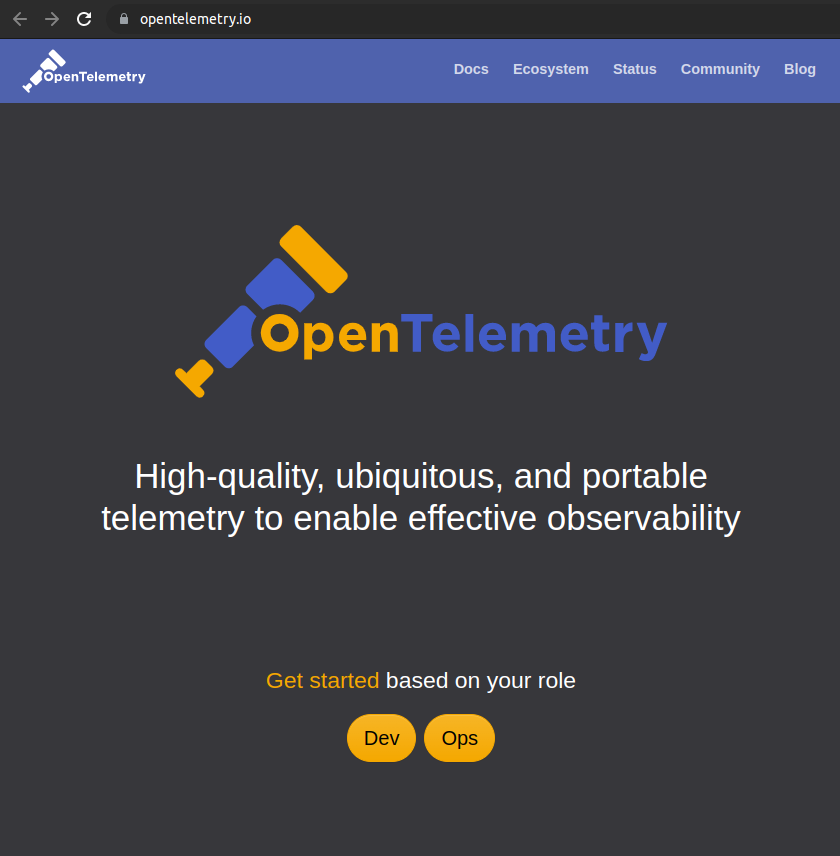
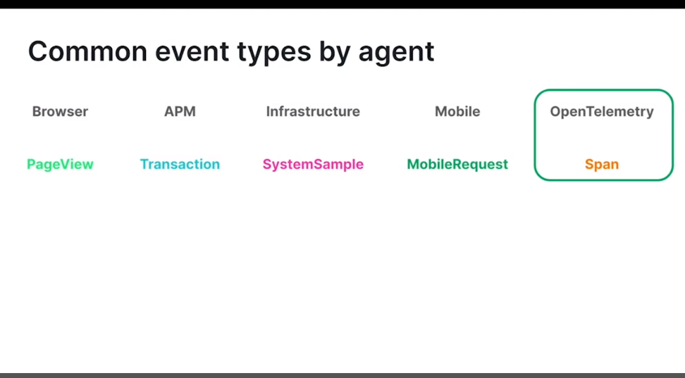
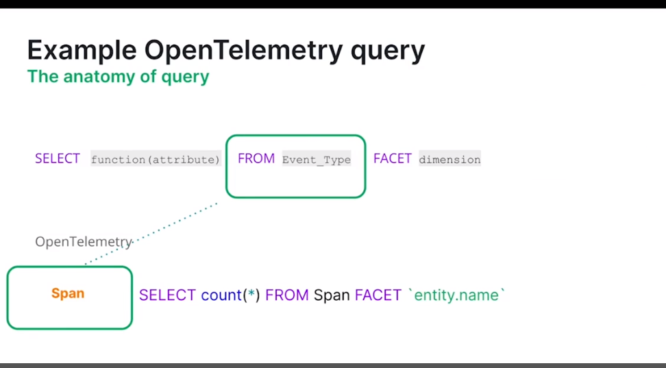
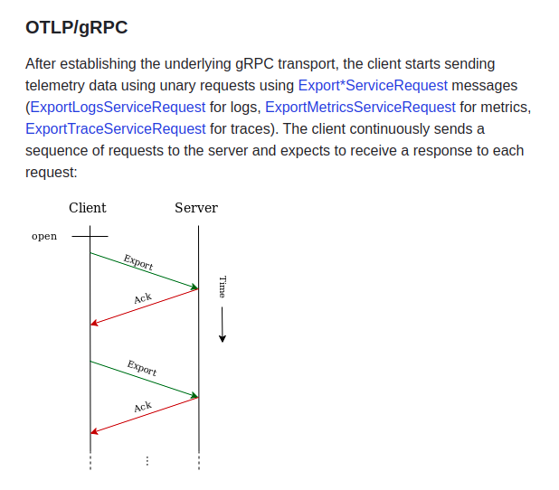
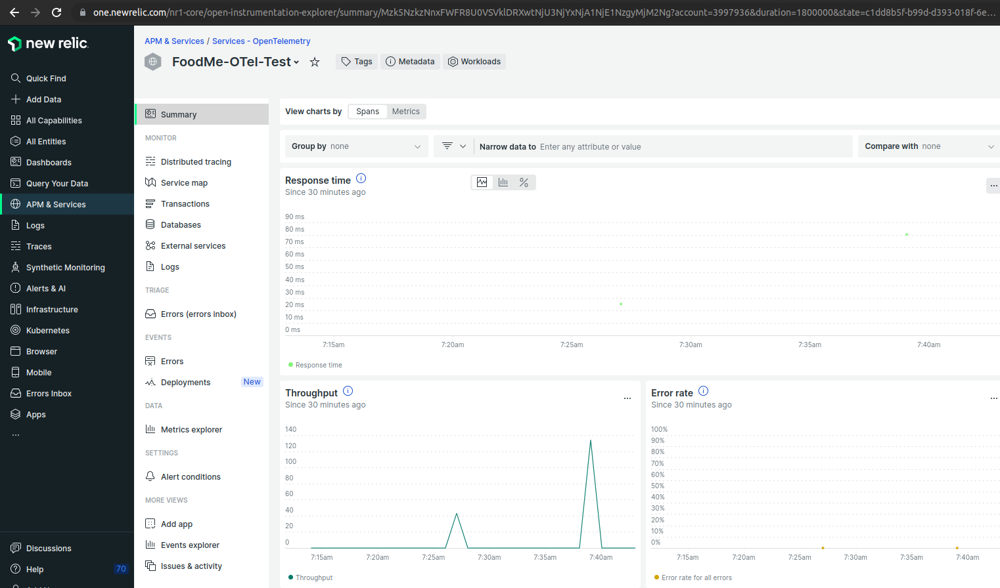

# OpenTelemetry

https://opentelemetry.io/

## An Open Source Data Collection Standard

# OTel Agent and Event Type

# OTel Query

### OTel is NOT

OpenTelemetry is not an observability solution by itself. It is a data collection standard. The data collected by OTel still needs to be sent to an observability vendor in order to get dashboards, alerts, etc. from your data.

# The OpenTelemetry Protocol (OTLP)

The OpenTelemetry Protocol (OTLP) specification describes the encoding, transport, and delivery mechanism of telemetry data between telemetry sources, intermediate nodes such as collectors and telemetry backends.

https://github.com/open-telemetry/opentelemetry-proto/blob/main/docs/specification.md

$ New Relic and OTel

Use OTel Data in New Relic

